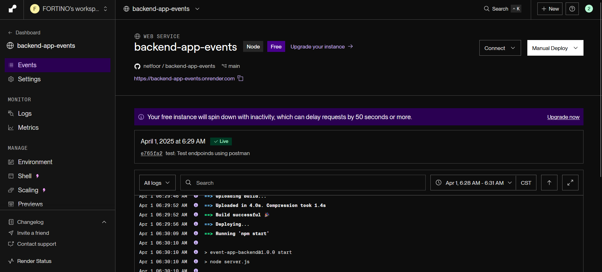
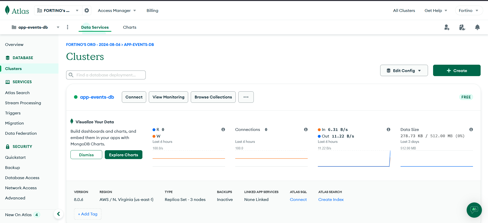
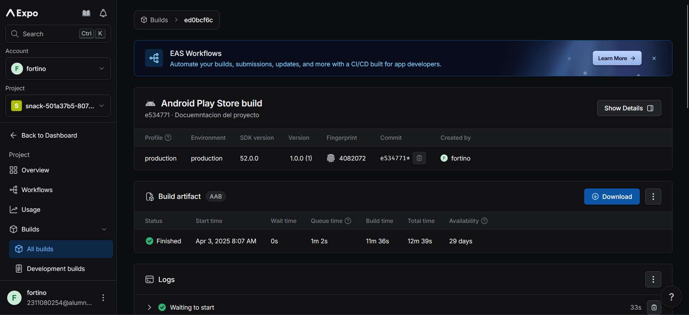

# 📱 EventUp

**Descripción:** EventUp es una aplicación móvil que permite a los usuarios descubrir, crear y gestionar eventos de forma sencilla. Con una interfaz intuitiva, los usuarios pueden organizar eventos, establecer fechas, agregar participantes y dar seguimiento a sus actividades, facilitando una mejor gestión del tiempo y la organización personal o en equipo.

## 🎯 Objetivo General

El objetivo de EventUp es proporcionar una herramienta sencilla y eficiente para la gestión de eventos. Busca ayudar a los usuarios a mantenerse organizados al permitirles crear, categorizar y seguir el progreso de sus eventos, mejorando así su productividad personal. La aplicación facilita la visualización y priorización de actividades, optimizando el tiempo y los esfuerzos para cumplir con los objetivos.

## 🏗️ Arquitectura de la Aplicación

*   **Tipo de arquitectura:** Estructura Modular

*   **Justificación:** Se eligió una arquitectura monolítica para simplificar el desarrollo y mantenimiento de la aplicación en esta fase inicial. Al ser una aplicación con requerimientos específicos, una arquitectura monolítica permite un desarrollo más rápido, sin necesidad de gestionar múltiples servicios. Facilita la integración de nuevas funcionalidades y la resolución de errores, ya que toda la lógica está centralizada.

## 🔧 Backend

El backend está desplegado en Render y proporciona todas las APIs necesarias para el funcionamiento de la aplicación.

Punto de acceso: https://backend-app-events.onrender.com



*   **Repositorio:** [Backend EventUp](https://github.com/netfoor/backend-app-events.git)
*   **Base de datos:** MongoDB Atlas (base de datos NoSQL en la nube)



*   **Tecnologías principales:**
    *   Node.js con Express
    *   Mongoose para gestión de MongoDB
    *   JWT para autenticación
*   **API endpoints principales:**
    *   `/api/auth`: Autenticación de usuarios (registro, login)
    *   `/api/events`: CRUD de eventos
    *   `/api/activities`: Gestión de actividades
    *   `/api/ratings`: Sistema de calificaciones

## 🚀 Framework de Desarrollo

*   **Framework:** React Native con Expo
*   **Justificación:** Se eligió React Native debido a su capacidad para desarrollar aplicaciones móviles tanto para iOS como para Android utilizando una sola base de código. Esto reduce significativamente el tiempo y el esfuerzo de desarrollo. Expo se utiliza para facilitar la configuración y el despliegue de la aplicación, ya que ofrece herramientas y bibliotecas listas para usar.

## 🗂️ Estrategia de Versionamiento

Versionamiento por ramas:

*   `main` → Rama principal con la documentación.
*   `Israel` → Israel
*   `Fortino` → Fortino
*   `Joel` → Joel

## 🎨 Wireframes/Mockups

Puedes visualizar los wireframes de la aplicación en los siguientes enlaces:

*   🎨 [Diseño en Figma](link_del_diseño_figma)
*   📱 [Prototipo interactivo](link_del_prototipo)
*   📊 [Diagrama de flujo](link_del_diagrama)

Se encuentra disponible en la carpeta `Diseños`

## 📂 Repositorio GitHub

[Enlace al repositorio: GitHub Repo](https://github.com/Ability2040/mi-app-movil.git)

## ✨ Características

*   **Autenticación de Usuarios:** Sistema seguro de inicio de sesión y registro.
*   **Gestión de Eventos:** Crear, ver y participar en eventos.
*   **Detalles de Actividades:** Vista detallada de actividades con calificaciones.
*   **Gestión de Asistentes:** Agregar y gestionar asistentes a eventos.
*   **Sistema de Calificaciones:** Dejar y ver calificaciones para eventos y actividades.

## 🛠️ Tecnologías Utilizadas

*   **Framework:** React Native con Expo
*   **Navegación:** React Navigation
*   **Componentes UI:** Componentes personalizados (Button, Card, Input, etc.)
*   **Gestión de Estado:** React Context API (AuthContext, EventContext)
*   **Iconos:** Ionicons
*   **Gestión de Activos:** Cargadores de Expo Asset y Font


## ⚙️ Instalación y Configuración

Sigue estos pasos para configurar y ejecutar la aplicación:

Clonar el repositorio:

```bash
git clone <url_del_repositorio>
cd app_eventup
```

Instalar dependencias:

```bash
npm install
# o
yarn install
```

Iniciar el servidor de desarrollo:

```bash
npm start
# o
yarn start
```

Usar la aplicación Expo Go: En su dispositivo, use la aplicación Expo Go para escanear el código QR que aparece en la terminal, o use un emulador.

## 📁 Estructura del Proyecto

```
app_eventup/
├── assets/             # Contiene imágenes e iconos de la aplicación
├── src/                # Código fuente principal
│   ├── components/     # Componentes de UI reutilizables
│   ├── context/        # Proveedores de React Context
│   ├── hooks/          # Hooks personalizados de React
│   ├── navigation/     # Configuración de navegación
│   ├── screens/        # Pantallas de la aplicación
│   └── services/       # Servicios API y utilidades
├── App.js              # Archivo principal de la aplicación
├── app.json            # Configuración de Expo
└── package.json        # Dependencias del proyecto
```

## 🧪 Desarrollo

La aplicación utiliza Expo para simplificar el desarrollo. Puedes:

*   Usar Expo Go para pruebas rápidas en dispositivos físicos.
*   Usar emuladores iOS/Android para desarrollo.
*   Exportar a una aplicación independiente usando los servicios de construcción de Expo.

## 📱 Archivo APK (ABB)

La aplicación está disponible en formato ABB (Android App Bundle) a través de Expo Dev Builds. Esto permite una instalación y distribución más eficiente en dispositivos Android.

Para construir el ABB:

```bash
npm run build:android:preview
# o
npm run build:android:prod
```

El archivo generado estará disponible en su cuenta de Expo, o puede descargarlo directamente desde el panel de Expo.



## 👥 Contribuir

¡Las contribuciones son bienvenidas! Sigue estos pasos:

1.  Hacer fork del repositorio.
2.  Crear una rama para tu funcionalidad (`git checkout -b feature/nueva-funcionalidad`).
3.  Confirmar tus cambios (`git commit -m 'Agrega una nueva funcionalidad'`).
4.  Enviar a la rama (`git push origin feature/nueva-funcionalidad`).
5.  Crear un nuevo Pull Request.

## 📄 Licencia

Este proyecto está licenciado bajo la Licencia MIT.